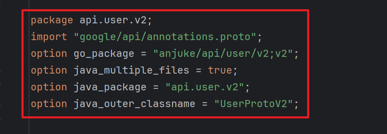

# Kratos Project Template

## Install Kratos
```
go install github.com/go-kratos/kratos/cmd/kratos/v2@latest
```
## Create a service
```
# Create a template project
kratos new server

cd server
# Add a proto template
kratos proto add api/server/server.proto
# Generate the proto code
kratos proto client api/server/server.proto
# Generate the source code of service by proto file
kratos proto server api/server/server.proto -t internal/service

go generate ./...
go build -o ./bin/ ./...
./bin/server -conf ./configs
```
## Generate other auxiliary files by Makefile
```
# Download and update dependencies
make init
# Generate API files (include: pb.go, http, grpc, validate, swagger) by proto file
make api
# Generate all files
make all
```
## Automated Initialization (wire)
```
# install wire
go get github.com/google/wire/cmd/wire

# generate wire
cd cmd/server
wire
```

## Docker
```bash
# build
docker build -t <your-docker-image-name> .

# run
docker run --rm -p 8000:8000 -p 9000:9000 -v </path/to/your/configs>:/data/conf <your-docker-image-name>
```

## 如何创建proto文件
     kratos proto add api/user/v2/user.proto

## 编写完proto文件后然后再次生成proto文件
     kratos proto client api/user/v2/user.proto

## 如果生成完proto文件后没有http.pb文件的话说明proto文件中没有
    rpc CreateUser (CreateUserRequest) returns (CreateUserReply){
	没有这个：option (google.api.http) = {
			post: "/user/create"
			body:"*"
				};
	};

## 编辑完conf.proto文件后如何从新生成pb文件
    使用 make config 执行 protoc --proto_path=./internal \
       --proto_path=./third_party \
               --go_out=paths=source_relative:./internal \
       internal/conf/conf.proto进行从新生成

## 编写api中proto时这些必须要有



# greeter是测试模块不用管
# user是用户模块
# house是房源模块
# transaction是交易模块
# points是积分模块
# customer是客服模块
# 每个api的proto文件中都有一个添加接口需要可以接着写，不需要直接删掉写别的
# 用户模块里写的登录注册一体化是一个示例可以参考