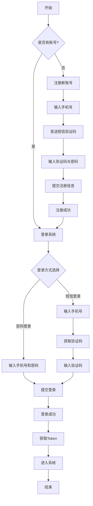
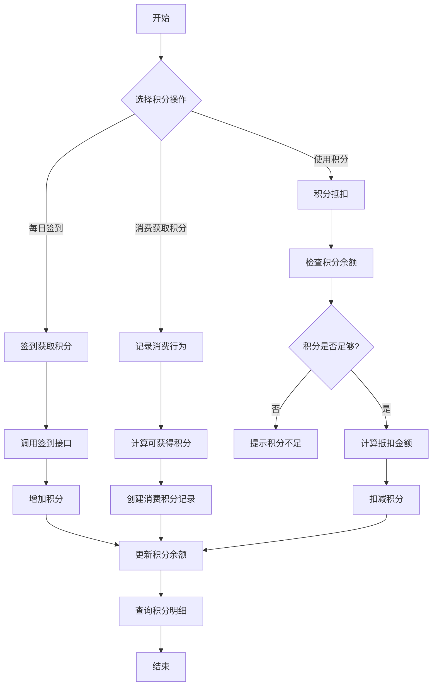
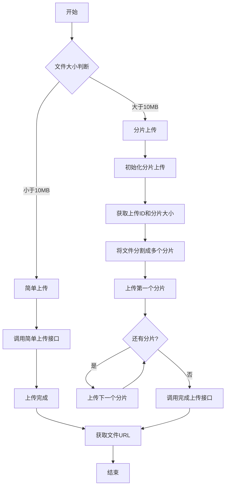
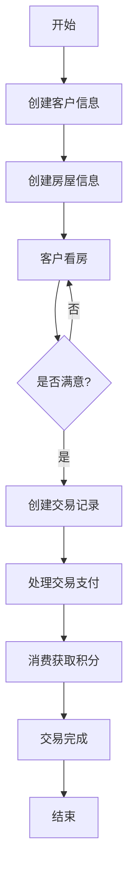

# 安居客系统API接口文档

## 目录
- [1. 概述](#1-概述)
- [2. 接口规范](#2-接口规范)
- [3. 用户模块](#3-用户模块)
- [4. 积分模块](#4-积分模块)
- [5. 文件上传模块](#5-文件上传模块)
- [6. 房屋模块](#6-房屋模块)
- [7. 客户模块](#7-客户模块)
- [8. 交易模块](#8-交易模块)
- [9. 业务流程图](#9-业务流程图)

## 1. 概述

本文档详细描述了安居客系统后端API接口规范，为前后端开发提供指导和参考。

### 1.1 接口基本信息

- 基础URL: `/api`
- 请求方式：GET, POST, DELETE
- 数据格式：JSON

## 2. 接口规范

### 2.1 统一响应格式

所有API响应均使用以下统一格式：

```json
{
  "code": 0,      // 响应码：0表示成功，非0表示失败
  "msg": "成功",  // 响应消息
  "data": {}      // 响应数据，具体结构根据接口不同而变化
}
```

### 2.2 分页信息

分页相关接口返回的分页信息格式如下：

```json
{
  "page": 1,        // 当前页码
  "page_size": 10,  // 每页数量
  "total": 100,     // 总记录数
  "total_pages": 10 // 总页数
}
```

## 3. 用户模块

### 3.1 创建用户

- **接口路径**：`/user/create`
- **请求方式**：POST
- **功能描述**：注册新用户

**请求参数：**

| 参数名 | 类型 | 是否必须 | 说明 |
|--------|------|----------|------|
| Mobile | string | 是 | 手机号 |
| NickName | string | 是 | 用户昵称 |
| Password | string | 是 | 密码 |
| Code | string | 是 | 短信验证码 |

**响应数据：**

```json
{
  "user_id": "123456",
  "mobile": "13812345678",
  "nick_name": "张三"
}
```

### 3.2 实名认证

- **接口路径**：`/user/realname`
- **请求方式**：POST
- **功能描述**：用户实名认证

**请求参数：**

| 参数名 | 类型 | 是否必须 | 说明 |
|--------|------|----------|------|
| UserId | uint64 | 是 | 用户ID |
| Name | string | 是 | 真实姓名 |
| IdCard | string | 是 | 身份证号码 |

**响应数据：**

```json
{
  "user_id": 123456,
  "name": "张三",
  "status": "verified" // 认证状态
}
```

### 3.3 发送短信验证码

- **接口路径**：`/user/sendSms`
- **请求方式**：POST
- **功能描述**：发送短信验证码

**请求参数：**

| 参数名 | 类型 | 是否必须 | 说明 |
|--------|------|----------|------|
| phone | string | 是 | 手机号 |
| device_id | string | 是 | 设备标识 |
| scene | string | 是 | 场景，如register, login, reset_password, bind_phone等 |

**响应数据：**

```json
{
  "phone": "13812345678",
  "scene": "register",
  "expire_time": 1624536372 // 验证码过期时间戳
}
```

### 3.4 验证短信验证码

- **接口路径**：`/user/verifySms`
- **请求方式**：POST
- **功能描述**：验证短信验证码

**请求参数：**

| 参数名 | 类型 | 是否必须 | 说明 |
|--------|------|----------|------|
| phone | string | 是 | 手机号 |
| code | string | 是 | 验证码 |
| scene | string | 是 | 验证场景，需与发送时一致 |

**响应数据：**

```json
{
  "phone": "13812345678",
  "success": true,
  "scene": "register"
}
```

### 3.5 用户登录

- **接口路径**：`/user/login`
- **请求方式**：POST
- **功能描述**：用户登录

**请求参数：**

| 参数名 | 类型 | 是否必须 | 说明 |
|--------|------|----------|------|
| login_type | string | 是 | 登录类型：password(密码登录), sms(短信登录) |
| mobile | string | 是 | 手机号 |
| password | string | 否 | 密码（密码登录时必须） |
| code | string | 否 | 验证码（短信登录时必须） |

**响应数据：**

```json
{
  "user_id": "123456",
  "mobile": "13812345678",
  "nick_name": "张三",
  "token": "eyJhbGci...", // JWT token
  "expire_time": 1624622772 // token过期时间戳
}
```

### 3.6 获取文件列表

- **接口路径**：`/user/fileList`
- **请求方式**：GET
- **功能描述**：获取用户上传的文件列表

**请求参数：**

| 参数名 | 类型 | 是否必须 | 说明 |
|--------|------|----------|------|
| page | int32 | 否 | 页码，默认1 |
| page_size | int32 | 否 | 每页数量，默认10 |
| keyword | string | 否 | 搜索关键词 |

**响应数据：**

```json
{
  "list": [
    {
      "id": "1",
      "name": "house.jpg",
      "size": 1024,
      "type": "image/jpeg",
      "url": "https://example.com/files/house.jpg",
      "upload_time": "2023-06-24 10:30:00",
      "status": "success",
      "object_name": "user/123/house.jpg"
    }
  ],
  "total": 10
}
```

### 3.7 删除文件

- **接口路径**：`/file/{object_name}`
- **请求方式**：DELETE
- **功能描述**：删除用户上传的文件

**路径参数：**

| 参数名 | 类型 | 是否必须 | 说明 |
|--------|------|----------|------|
| object_name | string | 是 | 文件对象名称 |

**响应数据：**

```json
{
  "object_name": "user/123/house.jpg",
  "success": true
}
```

### 3.8 获取上传统计

- **接口路径**：`/user/uploadStats`
- **请求方式**：GET
- **功能描述**：获取用户上传文件的统计信息

**响应数据：**

```json
{
  "total_uploads": 20,
  "success_uploads": 18,
  "total_size": 10485760, // 总上传大小（字节）
  "today_uploads": 3
}
```

## 4. 积分模块

### 4.1 查询用户积分余额

- **接口路径**：`/points/balance/{user_id}`
- **请求方式**：GET
- **功能描述**：查询用户的积分余额

**路径参数：**

| 参数名 | 类型 | 是否必须 | 说明 |
|--------|------|----------|------|
| user_id | uint64 | 是 | 用户ID |

**响应数据：**

```json
{
  "user_id": 123456,
  "total_points": 500 // 总积分
}
```

### 4.2 查询积分明细记录

- **接口路径**：`/points/history/{user_id}`
- **请求方式**：GET
- **功能描述**：查询用户的积分明细记录

**路径参数：**

| 参数名 | 类型 | 是否必须 | 说明 |
|--------|------|----------|------|
| user_id | uint64 | 是 | 用户ID |

**查询参数：**

| 参数名 | 类型 | 是否必须 | 说明 |
|--------|------|----------|------|
| page | int32 | 否 | 页码，默认1 |
| page_size | int32 | 否 | 每页数量，默认20 |
| type | string | 否 | 类型筛选：earn(获取) 或 use(消费)，空表示全部 |

**响应数据：**

```json
{
  "records": [
    {
      "id": 1,
      "user_id": 123456,
      "type": "checkin", // 签到
      "points": 10,      // 获得10积分
      "description": "每日签到",
      "order_id": "",
      "amount": 0,
      "created_at": "2023-06-24 08:00:00"
    },
    {
      "id": 2,
      "user_id": 123456,
      "type": "consume", // 消费获取积分
      "points": 50,      // 获得50积分
      "description": "购买商品",
      "order_id": "ORDER123456",
      "amount": 10000, // 100元（分为单位）
      "created_at": "2023-06-24 10:30:00"
    },
    {
      "id": 3,
      "user_id": 123456,
      "type": "use",    // 使用积分
      "points": -20,    // 使用20积分
      "description": "积分抵扣",
      "order_id": "ORDER234567",
      "amount": 200,    // 抵扣2元（分为单位）
      "created_at": "2023-06-24 15:45:00"
    }
  ],
  "page_info": {
    "page": 1,
    "page_size": 20,
    "total": 10,
    "total_pages": 1
  }
}
```

### 4.3 签到获取积分

- **接口路径**：`/points/checkin`
- **请求方式**：POST
- **功能描述**：用户签到获取积分

**请求参数：**

| 参数名 | 类型 | 是否必须 | 说明 |
|--------|------|----------|------|
| user_id | uint64 | 是 | 用户ID |

**响应数据：**

```json
{
  "points_earned": 10,      // 获得的积分
  "total_points": 510,      // 签到后总积分
  "consecutive_days": 3     // 连续签到天数
}
```

### 4.4 消费获取积分

- **接口路径**：`/points/earn/consume`
- **请求方式**：POST
- **功能描述**：用户消费后获取相应积分

**请求参数：**

| 参数名 | 类型 | 是否必须 | 说明 |
|--------|------|----------|------|
| user_id | uint64 | 是 | 用户ID |
| order_id | string | 是 | 订单ID |
| amount | int64 | 是 | 消费金额（分为单位） |

**响应数据：**

```json
{
  "points_earned": 50,      // 获得的积分
  "total_points": 560       // 获得积分后的总积分
}
```

### 4.5 使用积分抵扣

- **接口路径**：`/points/use`
- **请求方式**：POST
- **功能描述**：使用积分进行抵扣

**请求参数：**

| 参数名 | 类型 | 是否必须 | 说明 |
|--------|------|----------|------|
| user_id | uint64 | 是 | 用户ID |
| points | int64 | 是 | 要使用的积分数量 |
| order_id | string | 是 | 关联订单ID |
| description | string | 否 | 使用描述 |

**响应数据：**

```json
{
  "points_used": 20,        // 实际使用的积分
  "amount_deducted": 200,   // 抵扣的金额（分为单位，2元）
  "total_points": 540       // 剩余总积分
}
```

## 5. 文件上传模块

### 5.1 简单上传（小文件）

- **接口路径**：`/api/upload/smart`
- **请求方式**：POST
- **功能描述**：上传小文件（适合小于10MB的文件）

**请求参数：**

| 参数名 | 类型 | 是否必须 | 说明 |
|--------|------|----------|------|
| filename | string | 是 | 文件名 |
| content_type | string | 是 | 内容类型 |
| file_data | bytes | 是 | 文件内容 |

**响应数据：**

```json
{
  "url": "https://example.com/files/filename.jpg" // 文件访问URL
}
```

### 5.2 初始化分片上传

- **接口路径**：`/api/upload/init`
- **请求方式**：POST
- **功能描述**：初始化分片上传，适用于大文件上传

**请求参数：**

| 参数名 | 类型 | 是否必须 | 说明 |
|--------|------|----------|------|
| filename | string | 是 | 文件名 |
| content_type | string | 是 | 内容类型 |
| total_size | int64 | 是 | 文件总大小（字节） |

**响应数据：**

```json
{
  "upload_id": "12345678",          // 上传ID
  "object_name": "user/123/file.mp4", // 对象名称
  "chunk_size": 5242880              // 分片大小（字节）
}
```

### 5.3 上传分片

- **接口路径**：`/api/upload/part`
- **请求方式**：POST
- **功能描述**：上传单个分片

**请求参数：**

| 参数名 | 类型 | 是否必须 | 说明 |
|--------|------|----------|------|
| upload_id | string | 是 | 上传ID |
| object_name | string | 是 | 对象名称 |
| part_number | int32 | 是 | 分片序号（从1开始） |
| file_data | bytes | 是 | 分片内容 |

**响应数据：**

```json
{
  "part_number": 1,
  "etag": "e868e0f4959f79c82e36a215c5f2742e",
  "size": 5242880
}
```

### 5.4 完成上传

- **接口路径**：`/api/upload/complete`
- **请求方式**：POST
- **功能描述**：完成分片上传

**请求参数：**

| 参数名 | 类型 | 是否必须 | 说明 |
|--------|------|----------|------|
| upload_id | string | 是 | 上传ID |
| object_name | string | 是 | 对象名称 |
| parts | array | 是 | 分片信息数组 |

分片信息结构：

```json
{
  "part_number": 1,
  "etag": "e868e0f4959f79c82e36a215c5f2742e",
  "size": 5242880
}
```

**响应数据：**

```json
{
  "url": "https://example.com/files/user/123/file.mp4" // 文件访问URL
}
```

### 5.5 查询已上传分片

- **接口路径**：`/api/upload/listParts`
- **请求方式**：GET
- **功能描述**：查询已上传的分片信息

**请求参数：**

| 参数名 | 类型 | 是否必须 | 说明 |
|--------|------|----------|------|
| upload_id | string | 是 | 上传ID |
| object_name | string | 是 | 对象名称 |

**响应数据：**

```json
{
  "parts": [
    {
      "part_number": 1,
      "etag": "e868e0f4959f79c82e36a215c5f2742e",
      "size": 5242880
    },
    {
      "part_number": 2,
      "etag": "f39a3ee920936f278b0a9141259b39a9",
      "size": 5242880
    }
  ]
}
```

### 5.6 中止上传

- **接口路径**：`/api/upload/abort`
- **请求方式**：POST
- **功能描述**：中止分片上传

**请求参数：**

| 参数名 | 类型 | 是否必须 | 说明 |
|--------|------|----------|------|
| upload_id | string | 是 | 上传ID |
| object_name | string | 是 | 对象名称 |

**响应数据：**

```json
{
  "success": true
}
```

## 6. 房屋模块

### 6.1 创建房屋

- **接口路径**：`/house/create`
- **请求方式**：POST
- **功能描述**：创建房屋信息

**请求参数：**

| 参数名 | 类型 | 是否必须 | 说明 |
|--------|------|----------|------|
| title | string | 是 | 房屋标题 |
| address | string | 是 | 房屋地址 |
| price | int64 | 是 | 价格（单位：元） |
| type | string | 是 | 房屋类型 |
| area | int32 | 是 | 面积（平方米） |

**响应数据：**

```json
{
  "house_id": "123456",
  "title": "市中心豪华公寓",
  "address": "上海市浦东新区陆家嘴",
  "price": 2000000,
  "type": "公寓",
  "area": 120,
  "created_at": "2023-06-24 14:30:00"
}
```

## 7. 客户模块

### 7.1 创建客户

- **接口路径**：`/customer/create`
- **请求方式**：POST
- **功能描述**：创建客户信息

**请求参数：**

| 参数名 | 类型 | 是否必须 | 说明 |
|--------|------|----------|------|
| name | string | 是 | 客户姓名 |
| phone | string | 是 | 联系电话 |
| email | string | 否 | 电子邮件 |
| address | string | 否 | 联系地址 |

**响应数据：**

```json
{
  "customer_id": "123456",
  "name": "李四",
  "phone": "13912345678",
  "email": "lisi@example.com",
  "address": "北京市朝阳区",
  "created_at": "2023-06-24 16:45:00"
}
```

## 8. 交易模块

### 8.1 创建交易

- **接口路径**：`/transaction/create`
- **请求方式**：POST
- **功能描述**：创建交易记录

**请求参数：**

| 参数名 | 类型 | 是否必须 | 说明 |
|--------|------|----------|------|
| user_id | uint64 | 是 | 用户ID |
| amount | int64 | 是 | 交易金额（分为单位） |
| type | string | 是 | 交易类型 |
| description | string | 否 | 交易描述 |

**响应数据：**

```json
{
  "transaction_id": "TX123456",
  "user_id": 123456,
  "amount": 100000, // 1000元
  "type": "payment",
  "status": "completed",
  "created_at": "2023-06-24 17:30:00"
}
```

## 9. 业务流程图

### 9.1 用户注册与登录流程



### 9.2 积分业务流程



### 9.3 文件上传流程



### 9.4 房屋交易流程


